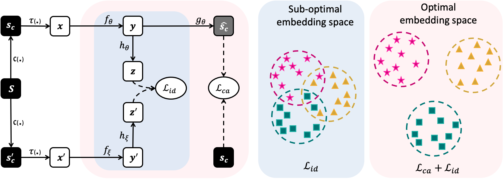
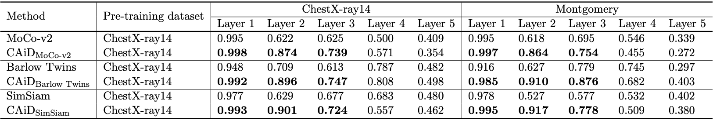

# CAiD: Context-Aware Instance Discrimination for Self-supervised Learning in Medical Imaging

This repository provides a PyTorch implementation of the [CAiD: Context-Aware Instance Discrimination for Self-supervised Learning in Medical Imaging]().

This is the first work that quantitatively and systematically shows the general limitation of instance discrimination methods in learning a distinct set of features from unlabeled medical images due to their global anatomical similarity. To alleviate this problem, we propose Context-Aware instance Discrimination (CAiD), a simple yet powerful self-supervised framework that formulates an auxiliary context prediction task to equip instance discrimination learning with  fine-grained contextual information captured from local regions of images.

<br/>
<p align="center"></p>
<br/>

## Publication
<b>CAiD: Context-Aware Instance Discrimination for Self-supervised Learning in Medical Imaging </b> <br/>
[Mohammad Reza Hosseinzadeh Taher](https://github.com/MR-HosseinzadehTaher)<sup>1</sup>, [Fatemeh Haghighi](https://github.com/fhaghighi)<sup>1</sup>, [Michael B. Gotway](https://www.mayoclinic.org/biographies/gotway-michael-b-m-d/bio-20055566)<sup>2</sup>, [Jianming Liang](https://chs.asu.edu/jianming-liang)<sup>1</sup><br/>
<sup>1 </sup>Arizona State University, <sup>2 </sup>Mayo Clinic <br/>
Published in: **International Conference on Medical Imaging with Deep Learning (MIDL), 2022.**


[Paper](#) | [Code](https://github.com/MR-HosseinzadehTaher/CAiD) | [Poster](#) | [Slides](#) | Presentation ([YouTube](#), [YouKu](#))

## Major results from our work
1. **CAiD enriches existing instance discrimination methods.**
<br/>
<p align="center"></p>
<br/>

2. **CAiD provides more separable features.**
<br/>
<p align="center"></p>
<br/>

3. **CAiD provides more reusable low/mid-level features.**
<br/>
<p align="center"></p>
<br/>

Credit to [superbar](https://github.com/scottclowe/superbar) by Scott Lowe for Matlab code of superbar.

## Requirements
+ Linux
+ Python
+ Install PyTorch ([pytorch.org](http://pytorch.org))

## Installation
Clone the repository and install dependencies using the following command:
```bash
$ git clone https://github.com/MR-HosseinzadehTaher/CAiD.git
$ cd CAiD/
$ pip install -r requirements.txt
```

## Self-supervised pre-training
### 1. Preparing data
We used traing set of ChestX-ray14 dataset for pre-training CAiD models, which can be downloaded from [this link](https://nihcc.app.box.com/v/ChestXray-NIHCC).

- The downloaded ChestX-ray14 should have a directory structure as follows:
```
ChestX-ray14/
    |--  images/ 
         |-- 00000012_000.png
         |-- 00000017_002.png
         ... 
```
We use 10% of training data for validation. We also provide the list of training and validation images in ``dataset/Xray14_train_official.txt`` and ``dataset/Xray14_val_official.txt``, respectively. The training set is based on the officiall split provided by ChestX-ray14 dataset. Training labels are not used during pre-training stage. The path to images folder is required for pre-training stage.

### 2. Pre-training CAiD
This implementation only supports multi-gpu, DistributedDataParallel training, which is faster and simpler; single-gpu or DataParallel training is not supported. The instance discrimination setup follows [MoCo](https://github.com/facebookresearch/moco). The checkpoints with the lowest validation loss are used for fine-tuning.

To do unsupervised pre-training of a U-Net model with ResNet-50 backbone on ChestX-ray14 using 4 NVIDIA V100 GPUs, run the following command:
```bash
python main_CAiD_moco.py /path/to/images/folder --dist-url 'tcp://localhost:10001' --multiprocessing-distributed \
--world-size 1 --rank 0 --mlp --moco-t 0.2  --cos --mode caid 
```

## Fine-tuning on downstream tasks
For downstream tasks, we use the code provided by recent [transfer learning benchmark](https://github.com/MR-HosseinzadehTaher/BenchmarkTransferLearning) in medical imaging. 

CAiD provides a pre-trained U-Net model, which the encoder can be utilized for the <i>classification</i> and encoder-decoder for the  <i>segmentation</i> downstream tasks. 

For classification tasks, a ResNet-50 encoder can be initialized with the pre-trained encoder of CAiD as follows:
```python
import torchvision.models as models

num_classes = #number of target task classes
weight = #path to CAiD pre-trained model
model = models.__dict__['resnet50'](num_classes=num_classes)
state_dict = torch.load(weight, map_location="cpu")
if "state_dict" in state_dict:
   state_dict = state_dict["state_dict"]
state_dict = {k.replace("module.", ""): v for k, v in state_dict.items()}
state_dict = {k.replace("backbone.", ""): v for k, v in state_dict.items()}
state_dict = {k.replace("encoder.", ""): v for k, v in state_dict.items()}
for k in list(state_dict.keys()):
   if k.startswith('fc') or k.startswith('segmentation_head') or k.startswith('decoder') :
      del state_dict[k]
msg = model.load_state_dict(state_dict, strict=False)
print("=> loaded pre-trained model '{}'".format(weight))
print("missing keys:", msg.missing_keys)
```

For segmentation tasks, a U-Net can be initialized with the pre-trained encoder and decoder of CAiD as follows:
```python
import segmentation_models_pytorch as smp

backbone = 'resnet50'
weight = #path to CAiD pre-trained model
model=smp.Unet(backbone)
state_dict = torch.load(weight, map_location="cpu")
if "state_dict" in state_dict:
   state_dict = state_dict["state_dict"]
state_dict = {k.replace("module.", ""): v for k, v in state_dict.items()}
state_dict = {k.replace("backbone.", ""): v for k, v in state_dict.items()}
for k in list(state_dict.keys()):
   if k.startswith('fc') or k.startswith('segmentation_head'):
      del state_dict[k]
msg = model.load_state_dict(state_dict, strict=False)
print("=> loaded pre-trained model '{}'".format(weight))
print("missing keys:", msg.missing_keys)

```


## Citation
If you use this code or use our pre-trained weights for your research, please cite our paper:
```
@inproceedings{
taher2022caid,
title={CAiD: Context-Aware Instance Discrimination for Self-supervised Learning in Medical Imaging},
author={ Hosseinzadeh Taher, Mohammad Reza and Haghighi, Fatemeh  and Gotway, Michael  and Liang, Jianming },
booktitle={Medical Imaging with Deep Learning},
year={2022},
}
```
## Acknowledgement
This research has been supported in part by ASU and Mayo Clinic through a Seed Grant and an Innovation Grant and in part by the NIH under Award Number R01HL128785. The content is solely the responsibility of the authors and does not necessarily represent the official views of the NIH. This work has utilized the GPUs provided in part by the ASU Research Computing and in part by the Extreme Science and Engineering Discovery Environment (XSEDE) funded by the National Science Foundation (NSF) under grant number ACI-1548562. The content of this paper is covered by patents pending. We build U-Net architecture for segmentation tasks by referring to the released code at [segmentation_models.pytorch](https://github.com/qubvel/segmentation_models.pytorch). The instance discrimination is based on [MoCo](https://github.com/facebookresearch/moco).


## License

Released under the [ASU GitHub Project License](./LICENSE).
