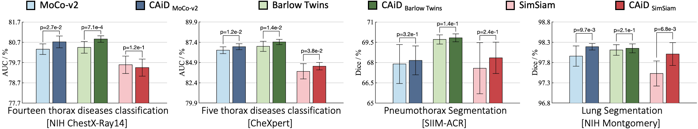
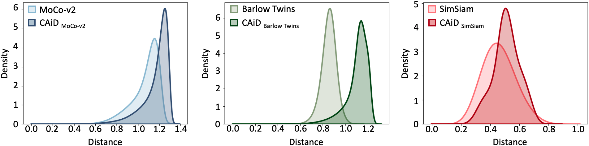

# CAiD: A Self-supervised Learning Framework for Empowering Instance Discrimination in Medical Imaging

This is the first work that quantitatively and systematically shows the limitation of instance discrimination methods in learning a distinct set of features from medical images and that offers a solution for alleviating the limitation.

In this repository we will release multiple models from our paper as well as the code to fine-tuning the released models in desired target tasks. 

## Publication
<b>CAiD: A Self-supervised Learning Framework for Empowering Instance Discrimination in Medical Imaging </b> <br/>
[Mohammad Reza Hosseinzadeh Taher](https://github.com/MR-HosseinzadehTaher)<sup>1</sup>, [Fatemeh Haghighi](https://github.com/fhaghighi)<sup>1</sup>, [Michael B. Gotway](https://www.mayoclinic.org/biographies/gotway-michael-b-m-d/bio-20055566)<sup>2</sup>, [Jianming Liang](https://chs.asu.edu/jianming-liang)<sup>1</sup><br/>
<sup>1 </sup>Arizona State University, <sup>2 </sup>Mayo Clinic <br/>


[Paper](#) | [Code](https://github.com/MR-HosseinzadehTaher/CAiD) | [Poster](#) | [Slides](#) | Presentation ([YouTube](#), [YouKu](#))

## Major results from our work
1. **CAiD enriches existing instance discrimination methods.**
<br/>
<p align="center"></p>
<br/>
Credit to [superbar](https://github.com/scottclowe/superbar) by Scott Lowe for Matlab code of superbar.


2. **CAiD provides more separable features.**
<br/>
<p align="center"></p>
<br/>

3. **CAiD provides more reusable low/mid-level features.**
<br/>

<br/>

## Installation
Clone the repository and install dependencies using the following command:
```bash
$ git clone https://github.com/MR-HosseinzadehTaher/CAiD.git
$ cd CAiD/
$ pip install -r requirements.txt
```

## Citation
If you use this code or use our pre-trained weights for your research, please cite our paper:
```
COMING SOON!
```
## Acknowledgement
This research has been supported partially by ASU and Mayo Clinic through a Seed Grant and an Innovation Grant, and partially by the NIH under Award Number R01HL128785.  The content is solely the responsibility of the authors and does not necessarily represent the official views of the NIH. This work has utilized the GPUs provided partially by the ASU Research Computing and partially by the Extreme Science and Engineering Discovery Environment (XSEDE) funded by the National Science Foundation (NSF) under grant number ACI-1548562. The content of this paper is covered by patents pending. We build U-Net architecture for segmentation tasks by referring to the released code at [segmentation_models.pytorch](https://github.com/qubvel/segmentation_models.pytorch).


## License

Released under the [ASU GitHub Project License](./LICENSE).
